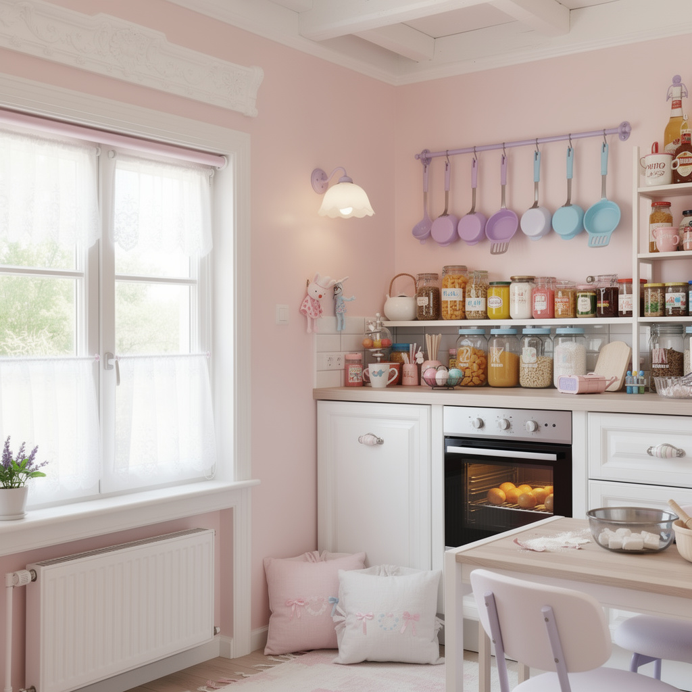
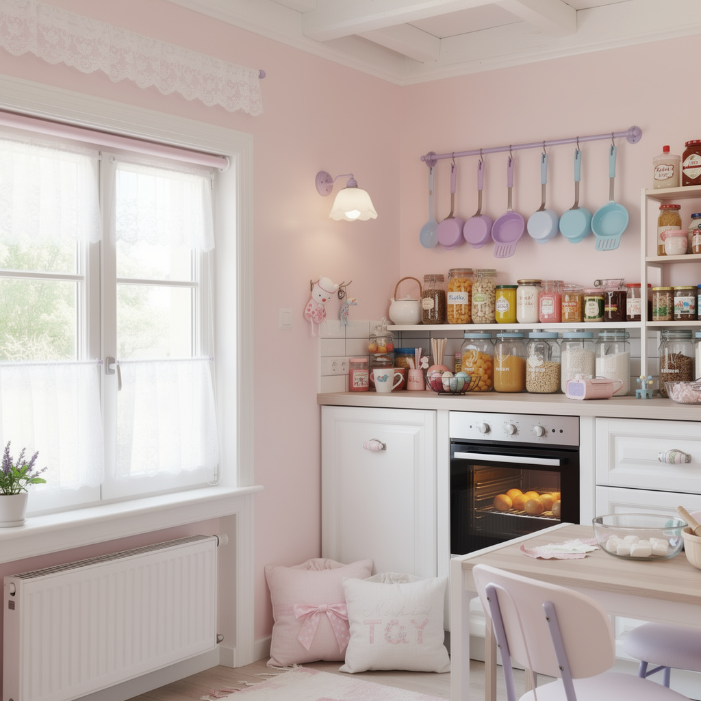
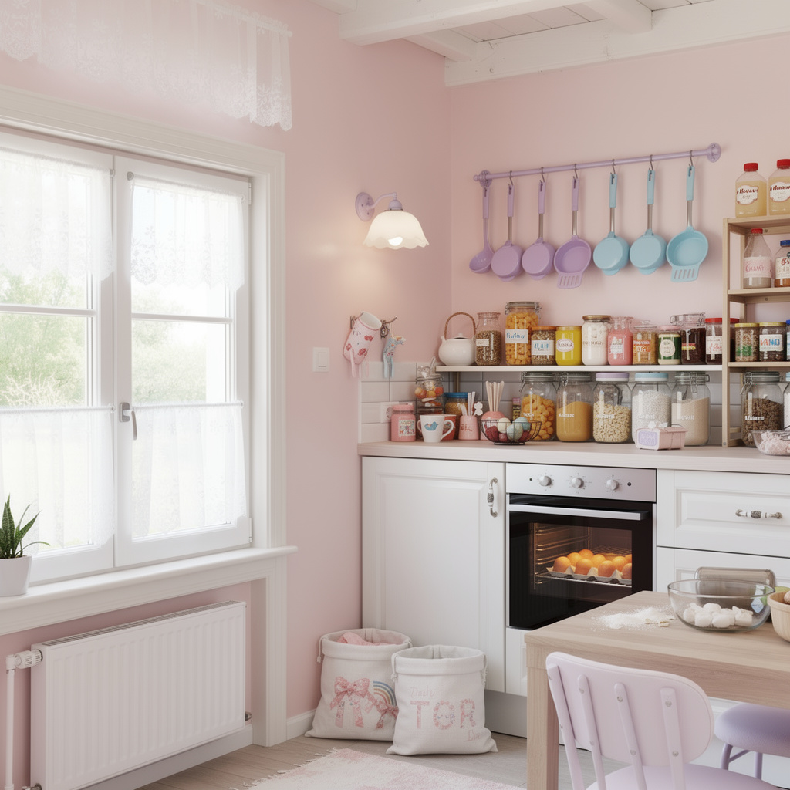
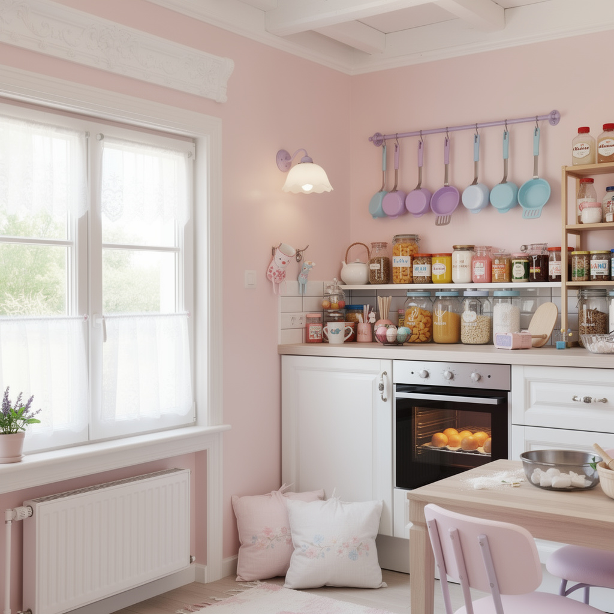
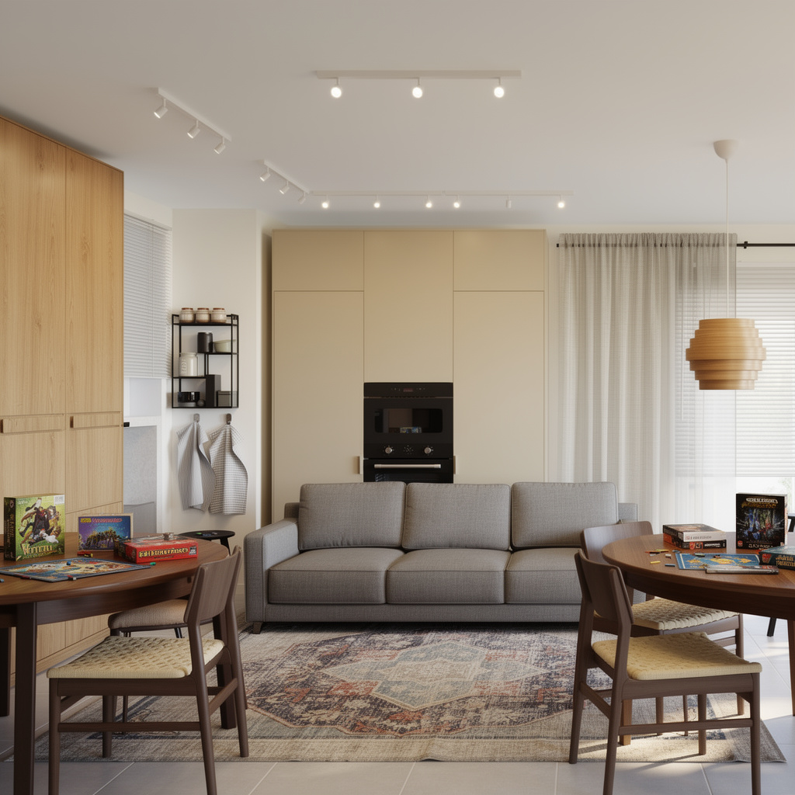
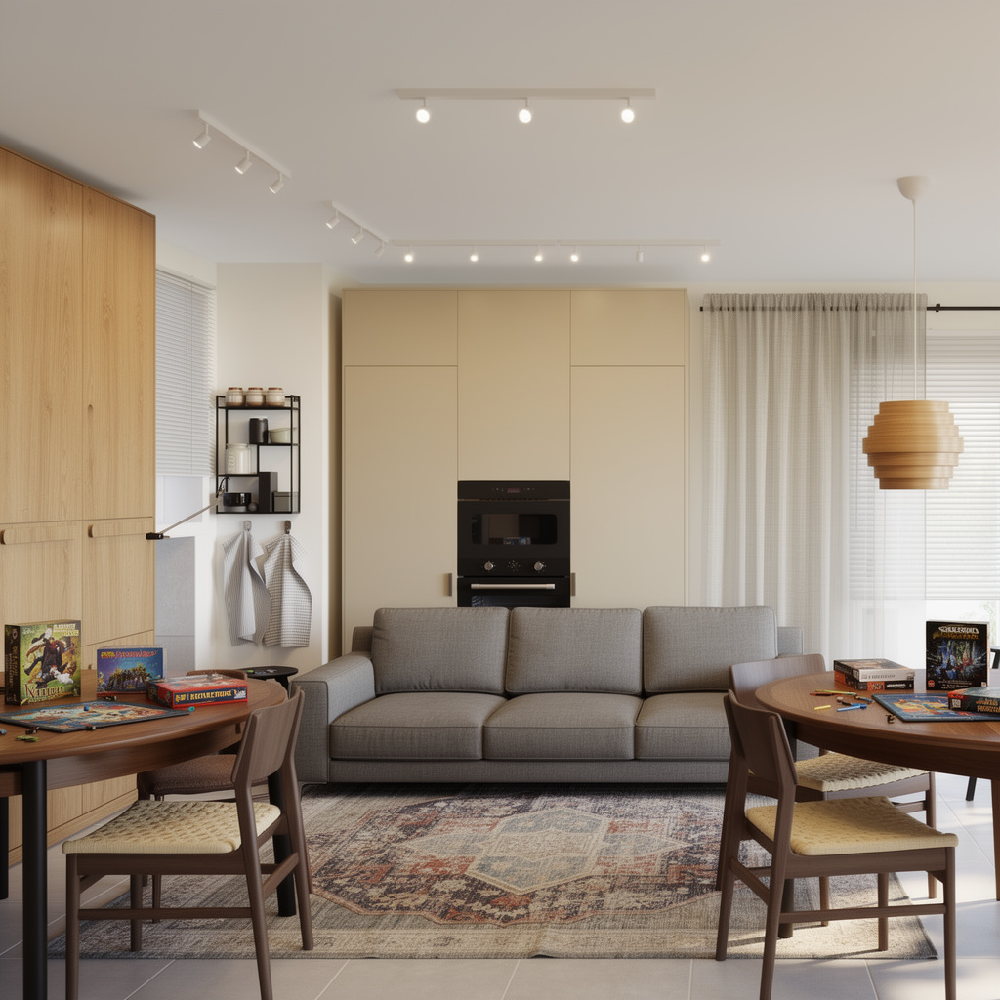

# EXP-001: Analysis — FLUX.2-pro Guidance Parameter

**Status:** Pending experiment completion

---

## Results Summary

_To be completed after running the experiment._

| Guidance | Kitchen | Bedroom | Living Room | Avg SSIM | Recommendation |
|----------|---------|---------|-------------|----------|----------------|
| 5 | — | — | — | — | |
| 10 | — | — | — | — | |
| 15 | — | — | — | — | |
| 20 | — | — | — | — | |
| 30 | — | — | — | — | |
| 50 | — | — | — | — | |

---

## Kitchen Results

### Visual Comparison

| Guidance 5 | Guidance 10 | Guidance 15 |
|------------|-------------|-------------|
|  |  |  |

| Guidance 20 | Guidance 30 | Guidance 50 |
|-------------|-------------|-------------|
|  |  |  |

### Observations

- **Guidance 5:**
- **Guidance 10:**
- **Guidance 15:**
- **Guidance 20:**
- **Guidance 30:**
- **Guidance 50:**

---

## Bedroom Results

_Pending test photo sourcing._

---

## Living Room Results

### Visual Comparison

| Guidance 5 | Guidance 10 | Guidance 15 |
|------------|-------------|-------------|
|  |  |  |

| Guidance 20 | Guidance 30 | Guidance 50 |
|-------------|-------------|-------------|
|  |  |  |

### Observations

- **Guidance 5:**
- **Guidance 10:**
- **Guidance 15:**
- **Guidance 20:**
- **Guidance 30:**
- **Guidance 50:**

---

## Conclusion

**Hypothesis supported?** _TBD_

**Recommended guidance value:** _TBD_

**Key findings:**
1. 
2. 
3. 

---

## Next Steps

- [ ] Action item based on findings
